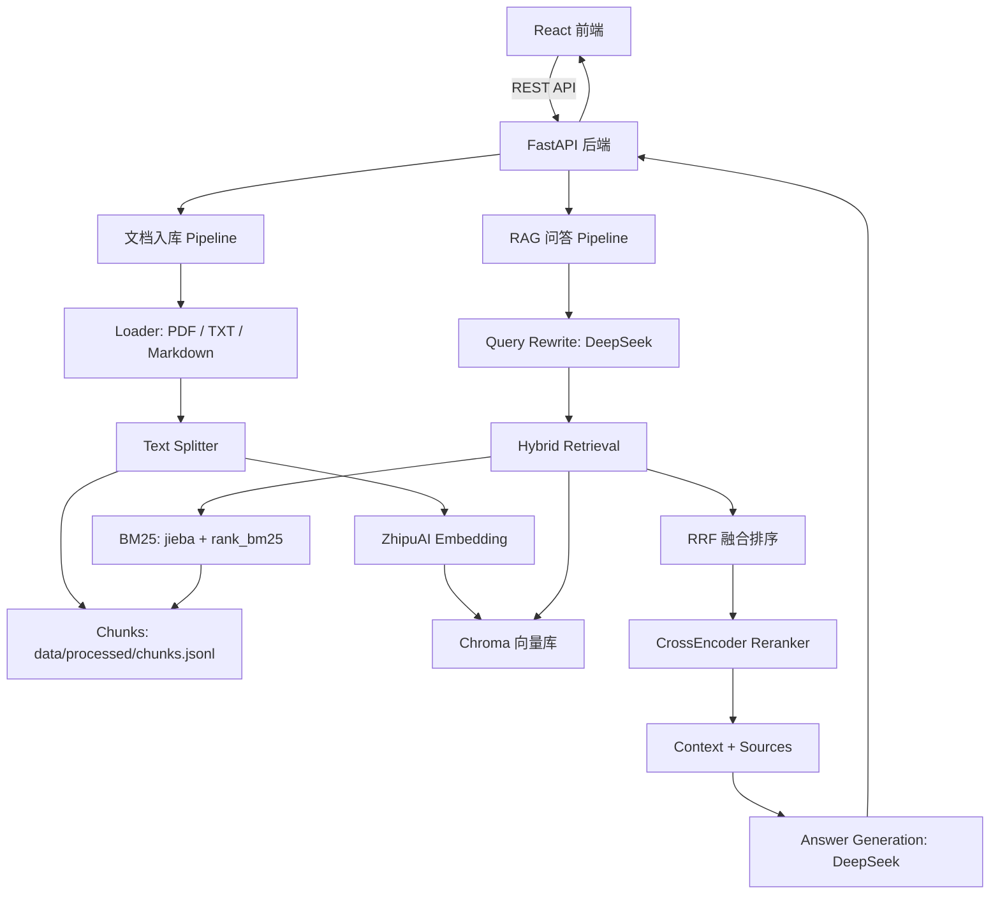

# RAG Knowledge Base Assistant

这是一个基于 FastAPI、LangChain、Chroma、智谱 Embedding 和 DeepSeek 的知识库问答系统。项目支持文档入库、自动切分、向量检索、RAG 问答、引用溯源和轻量评估。

## 项目背景

本项目用于模拟企业知识库问答场景。用户可以上传 PDF / TXT / Markdown 文件，系统会自动完成文本解析、文本切分和向量化入库。用户提问时，系统会通过 Query Rewrite 和 Hybrid Retrieval 召回相关片段，再调用大模型生成基于上下文的回答，并返回引用来源。

## 技术栈

- Backend: FastAPI
- RAG Framework: LangChain
- Embedding: 智谱 embedding-3
- LLM: DeepSeek Chat
- Vector Store: Chroma
- Retrieval: Query Rewrite, MMR, BM25, RRF, CrossEncoder Reranker
- Frontend: React + Vite + TypeScript
- Evaluation: 自定义轻量 RAG Eval

## 核心功能

- 文档上传和管理：支持上传 PDF、TXT 和 Markdown 格式文件，提供文档列表、删除文档和重建索引能力
- 文档解析和切分：基于 LangChain Loader 解析文档，并使用递归文本切分策略（RecursiveCharacterTextSplitter）生成 chunks
- 向量化和入库：使用智谱 embedding-3 模型生成文本向量，并持久化存储到 Chroma 向量库中
- 混合检索：支持向量检索、MMR检索和BM25关键词检索，并通过RRF融合多路检索结果
- Reranker 重排：在 Hybrid Retrieval 召回候选 chunks 后，使用 CrossEncoder Reranker 对候选结果进行二次排序，提高最终进入上下文的证据质量
- RAG问答：对用户问题进行query rewrite，检索相关上下文，基于检索结果，deepseek大模型给出最终回答
- 引用溯源：最终结果会返回检索命中片段的所有信息，包括页码，来源文件，文档片段之类的信息，方便验证答案依据
- 评估脚本：提供批量评估脚本，支持统计关键词命中率、来源命中率和平均延迟。
- 前端交互：React + Vite 实现文档上传、知识库问答、引用来源展示等完整交互。
- 统一 API 响应：后端接口使用统一成功/失败响应格式，并提供全局异常处理。

## 系统架构

```text
React 前端
  ├─ 文档上传
  ├─ 知识库问答
  └─ 引用来源展示
        │
        ▼
FastAPI 后端
  ├─ 文档管理接口
  │   ├─ 保存原始文件到 data/raw
  │   ├─ Loader 解析 PDF/TXT/Markdown
  │   ├─ Splitter 切分 chunks
  │   ├─ 保存 chunks 到 data/processed/chunks.jsonl
  │   └─ 调用 ZhipuAI Embedding 写入 Chroma
  │
  └─ RAG 问答接口
      ├─ DeepSeek Query Rewrite
      ├─ Chroma 向量检索
      ├─ BM25 关键词检索
      ├─ RRF 融合排序
      ├─ CrossEncoder Reranker 二次重排
      ├─ 构建上下文和引用来源
      └─ DeepSeek 生成回答
```

支持 Mermaid 的平台可以查看下面的架构图：



## RAG 流程

### 1. 文档入库流程

1. 上传文件后，第一步会给文件生成唯一的 `document_id`，然后将文件保存在 `data/raw/{document_id}/` 目录下
2. 根据文件类型，选择对应的解析器
3. 然后会通过切分器切分成多个 chunks。每个 chunk 不仅会携带原始内容，还会加上 `document_id`、`chunk_id`、`source`、`page`、`chunk_index` 等信息，方便后续溯源
4. 切分后的chunk会被写入两类存储：
    - `data/processed/chunks.jsonl`：保存 chunk 文本和 metadata，用于 BM25 检索、调试和重建索引
    - Chroma：保存 chunk 文本、metadata 和 embedding 向量，用于语义检索

### 2. 检索流程

1. 用户提问后，系统会先通过 DeepSeek 对问题进行 Query Rewrite，将原始问题改写成更适合知识库检索的查询。
2. 系统会同时执行两路检索：
   - MMR 向量检索：基于 Chroma 召回语义相关的 chunks，并通过 MMR 减少重复内容。
   - BM25 关键词检索：基于 `jieba` 分词和关键词匹配，补充精确词命中的能力。
3. 两路检索结果会通过 RRF 算法进行融合排序，并根据 `chunk_id` 去重。对于 `hybrid_rerank` 策略，系统会先保留更多候选 chunks，再使用 CrossEncoder Reranker 进行二次重排，最终选取 top-k 个 chunks 进入大模型上下文。


### 3. 生成流程

1. 将检索得到的chunks按照固定格式拼接为上下文 context,每个片段都来源、页码和 `chunk_id`等信息
2. 将用户原始问题和context一起传给llm，由模型基于检索到的上下文进行回答
3. 如果检索结果为空，系统会返回默认提示，避免大模型编造答案的情况
4. 最后接口会返回回答内容、引用来源 sources 和本次检索的相关信息，方便前端展示答案和溯源。

## 检索策略演进

1. 基础向量检索
项目最初使用 Chroma 向量数据库作为知识库索引，将用户问题转换为 embedding 后，在向量库中进行相似度检索。
该方案实现简单，能够快速完成 RAG 的最小闭环，但在实际测试中发现，普通相似度检索容易召回内容相近甚至重复的 chunk，导致上下文信息覆盖不够充分。

2. MMR检索优化
为了解决召回结果重复的问题，项目将普通相似度检索升级为 MMR 检索。

MMR，Maximal Marginal Relevance，最大边际相关性，是一种在“相关性”和“多样性”之间做平衡的检索策略。它不仅关注 chunk 与用户问题的相似度，也会尽量避免召回结果之间过于重复。

通过 MMR 检索，可以让最终进入大模型上下文的内容覆盖更多信息点，减少重复文本对上下文窗口的浪费。

3. Query Rewrite
在实际问答场景中，用户问题可能比较口语化、简略，或者和原始文档中的表达方式不完全一致。

因此项目加入了 Query Rewrite 查询改写流程：在正式检索前，先使用大模型将用户问题改写为更适合检索的查询语句，从而提升问题表达和文档内容之间的匹配度。

该步骤可以增强系统对模糊问题、口语化问题的召回能力。

4. Hybrid Retrieval 混合检索
在后续优化中，项目进一步实现了 Hybrid Retrieval 混合检索，将向量检索和关键词检索结合起来。

其中：

- 向量检索负责语义相似度匹配；
- BM25 关键词检索负责精确关键词、专业术语和定义类内容匹配；
- RRF 融合算法用于合并两路检索结果并重新排序。

相比单一向量检索，混合检索能够同时兼顾语义理解和关键词精确匹配，提高复杂问题下的召回稳定性。

5. Reranker 二次重排
在 Hybrid Retrieval 的基础上，项目进一步加入了 CrossEncoder Reranker。

Hybrid Retrieval 更偏向“召回”，目标是从向量检索和关键词检索中尽可能找到相关候选内容；Reranker 更偏向“精排”，它会对用户问题和候选 chunk 进行成对打分，重新判断每个 chunk 与问题的相关性。

因此最终检索链路变为：

```text
Query Rewrite
    -> MMR 向量检索 + BM25 关键词检索
    -> RRF 融合排序
    -> CrossEncoder Reranker 二次重排
    -> Top-K 上下文构建
```

该策略可以提升复杂问题下的上下文质量，但也会带来额外推理开销，因此项目保留了 `hybrid` 和 `hybrid_rerank` 两种策略，方便在效果和延迟之间进行权衡。

## API 接口

项目基于 FastAPI 实现，启动后可以通过 Swagger 查看完整接口文档：

```text
http://localhost:8000/docs
```

核心接口如下：

| Method | Path | Description |
| --- | --- | --- |
| POST | `/api/health` | 检查后端服务状态 |
| POST | `/api/documents/upload` | 上传文档并自动完成解析、切分、向量化和入库 |
| GET | `/api/documents` | 获取已上传文档列表 |
| DELETE | `/api/documents/{document_id}` | 删除文档及其对应 chunks 和向量数据 |
| POST | `/api/documents/rebuild-index` | 基于已上传文档重建索引 |
| POST | `/api/chat` | 基于知识库进行问答，支持多种检索策略 |

其中 `/api/chat` 是核心问答接口，支持 `similarity`、`mmr`、`hybrid` 和 `hybrid_rerank` 检索策略。

## 统一响应与异常处理

后端接口统一使用成功/失败响应结构，方便前端统一处理请求结果和错误提示。

成功响应格式：

```json
{
  "success": true,
  "code": "ok",
  "message": "Success",
  "data": {}
}
```

失败响应格式：

```json
{
  "success": false,
  "code": "ERROR_CODE",
  "message": "错误信息",
  "data": null
}
```

项目通过全局异常处理将业务异常、参数校验异常和未知异常转换为统一结构，避免接口返回格式不一致。

## 轻量评估

项目提供 `scripts/eval_rag.py` 用于对不同检索策略进行轻量评估，当前支持：

- `similarity`
- `mmr`
- `hybrid`
- `hybrid_rerank`

在 25 条自建评估集上，Hybrid Retrieval 与 Hybrid + Reranker 的结果如下：

| Strategy | Answer Hit Rate | Source Hit Rate | Avg Latency |
| --- | --- | --- | --- |
| hybrid | 100.00% | 96.00% | 2874 ms |
| hybrid_rerank | 100.00% | 96.00% | 4028 ms |

当前评估集下，两种策略的命中率接近，Reranker 主要体现为完整链路验证和更高延迟。后续可以通过增加复杂问题、跨章节问题和干扰问题，更充分地评估 Reranker 对检索质量的提升。

## 快速启动

### 后端启动

```bash
python3 -m venv .venv
source .venv/bin/activate
pip install -r requirements.txt
cp .env.example .env
```

填写 `.env` 中的模型 API Key 后启动服务：

```bash
uvicorn app.main:app --reload --app-dir backend
```

后端默认地址：

```text
http://localhost:8000
```

### 前端启动

```bash
cd frontend
npm install
npm run dev
```

前端默认地址：

```text
http://localhost:5173
```

## 环境变量

主要环境变量如下：

| Name | Description |
| --- | --- |
| `ZHIPU_API_KEY` | 智谱 Embedding API Key |
| `EMBEDDING_MODEL` | Embedding 模型名称，默认 `embedding-3` |
| `EMBEDDING_DIMENSIONS` | Embedding 维度，默认 `1024` |
| `DEEPSEEK_API_KEY` | DeepSeek API Key |
| `CHAT_MODEL` | 对话模型名称，默认 `deepseek-chat` |
| `CHROMA_PERSIST_DIR` | Chroma 向量库持久化目录 |

## 项目结构

```text
backend/   FastAPI 后端、RAG 核心逻辑和接口路由
frontend/  React 前端页面
scripts/   入库、检索对比和评估脚本
data/      原始文档、处理后的 chunks、向量库和评估结果
docs/      项目设计和接口说明文档
```

## 当前效果

当前项目已经完成端到端 RAG 流程，支持文档上传、知识库问答、引用来源展示和检索策略切换。

轻量评估结果：

| Strategy | Answer Hit Rate | Source Hit Rate | Avg Latency |
| --- | --- | --- | --- |
| hybrid | 100.00% | 96.00% | 2874 ms |
| hybrid_rerank | 100.00% | 96.00% | 4028 ms |

## 项目亮点

- 完整实现文档入库、向量化、检索、生成和引用溯源的 RAG Pipeline
- 支持 Query Rewrite，提升口语化问题和文档表达之间的匹配能力
- 实现 Hybrid Retrieval，将向量检索、BM25 关键词检索和 RRF 融合结合起来
- 引入 CrossEncoder Reranker，对候选 chunks 进行二次精排
- 提供轻量 Eval 脚本，对不同检索策略的命中率和延迟进行对比
- 前后端分离实现，支持文档管理、知识库问答和来源展示

## 后续优化

- 扩充评估集，增加跨章节问题、干扰问题和复杂推理问题
- 优化 PDF 清洗和 chunk metadata，加入章节标题等结构信息
- 支持更多文档类型，例如 Word、Excel、网页等
- 引入 Multi Query Retrieval，提高复杂问题召回能力
- 使用 pgvector 或其他生产级向量数据库
- 接入 RAGAS / LangSmith 等工具进行更系统的 RAG 评估
