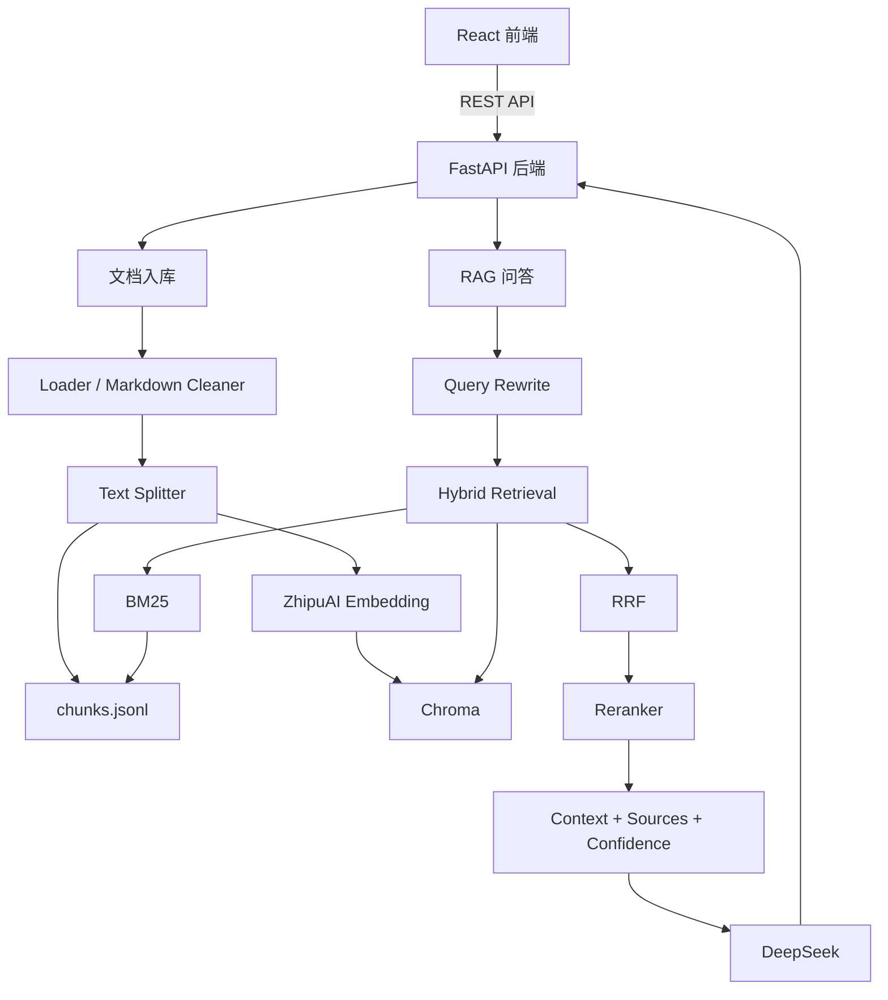

# RAG Knowledge Base Assistant

这是一个基于 FastAPI、LangChain、Chroma、智谱 Embedding 和 DeepSeek 的知识库问答系统。项目支持 PDF / TXT / Markdown / Obsidian 笔记入库，覆盖文档清洗、文本切分、向量化、检索增强、RAG 问答、引用溯源和轻量评估。

## 项目背景

本项目用于模拟个人知识库和企业知识库问答场景。用户可以上传文档，也可以批量导入本地 Obsidian Markdown 笔记。系统会自动完成文本解析、Markdown 清洗、chunk 切分、向量化入库和检索问答。

用户提问时，后端会基于不同检索策略召回相关 chunks，并调用大模型生成严格基于上下文的回答，同时返回引用来源和检索可信度，方便验证答案依据。

## 技术栈

- Backend: FastAPI
- RAG Framework: LangChain
- Embedding: 智谱 `embedding-3`
- LLM: DeepSeek Chat
- Vector Store: Chroma
- Retrieval: Similarity, MMR, BM25, RRF, Multi Query, CrossEncoder Reranker
- Frontend: React + Vite + TypeScript
- Evaluation: 自定义轻量 RAG Eval

## 核心功能

- 文档入库：支持 PDF、TXT、Markdown 文档上传和 Obsidian 笔记批量导入
- Markdown 清洗：处理 frontmatter、Obsidian 双链、图片引用、callout、Markdown 链接等语法噪声
- Chunk 切分：使用 LangChain Splitter 生成 chunks，并保留 `source`、`filename`、`folder`、`tags`、`chunk_id` 等 metadata
- 向量化入库：使用智谱 Embedding 生成向量，并持久化到 Chroma
- 多策略检索：支持 `similarity`、`mmr`、`hybrid`、`hybrid_rerank`、`multi_hybrid_rerank`
- RAG 问答：基于检索上下文调用 DeepSeek 生成答案
- 引用溯源：返回命中文档、chunk_id、页码或笔记路径，方便验证来源
- 可信度评分：基于召回数量、来源覆盖、关键词覆盖和重排分数生成 confidence
- 轻量评估：对不同检索策略进行来源命中率和关键词覆盖率评估
- 前端页面：支持文档管理、知识库问答、来源展示和检索策略切换

## 系统架构

```text
React 前端
  ├─ 文档上传
  ├─ 知识库问答
  └─ 来源展示
        │
        ▼
FastAPI 后端
  ├─ 文档入库 Pipeline
  │   ├─ Loader 解析 PDF / TXT / Markdown
  │   ├─ Markdown Cleaner 清洗 Obsidian 笔记
  │   ├─ Splitter 切分 chunks
  │   ├─ chunks.jsonl 保存文本和 metadata
  │   └─ ZhipuAI Embedding 写入 Chroma
  │
  └─ RAG 问答 Pipeline
      ├─ Query Rewrite
      ├─ Similarity / MMR 向量检索
      ├─ BM25 关键词检索
      ├─ RRF 融合排序
      ├─ CrossEncoder Reranker 二次重排
      ├─ Context + Sources + Confidence
      └─ DeepSeek 生成回答
```



## RAG 流程

### 1. 入库流程

1. 上传文档或批量导入 Obsidian 笔记。
2. 根据文件类型选择对应 Loader。
3. Markdown 笔记会经过专门的 cleaner，去掉语法噪声并保留代码块。
4. 文档被切分为 chunks，每个 chunk 携带 `document_id`、`chunk_id`、`source`、`filename`、`folder`、`tags` 等 metadata。
5. chunk 文本写入 `data/processed/chunks.jsonl`，同时写入 Chroma 向量库。

### 2. 检索流程

系统支持多种检索策略：

- `similarity`：基础向量相似度检索
- `mmr`：在相关性和多样性之间做平衡，减少重复召回
- `hybrid`：向量检索 + BM25 关键词检索 + RRF 融合
- `hybrid_rerank`：Hybrid 召回后使用 CrossEncoder Reranker 二次重排
- `multi_hybrid_rerank`：多查询召回 + Hybrid + Reranker，适合复杂问题

### 3. 生成流程

1. 将检索得到的 chunks 拼接成上下文。
2. 将用户问题和上下文传入 DeepSeek。
3. 模型只基于上下文生成答案。
4. 接口返回答案、引用来源、检索信息和 confidence。

## 文档清洗

项目针对不同文档类型采用不同清洗策略。

对于 Markdown / Obsidian 笔记：

- 去除 frontmatter、HTML 注释、图片引用和无用 Markdown 语法
- 清洗 Obsidian 双链和 callout
- 保留 C++ / 算法笔记中的代码块
- 提取标题、路径、文件夹、tags 等 metadata
- 在 chunk 前注入 `标题路径`，增强检索时的主题感知能力

对于 PDF 文档：

- 保留 Loader 对比能力，方便针对不同 PDF 类型选择解析器
- 通过文本清洗和 metadata 增强降低解析噪声影响
- 在来源展示中保留页码和 chunk_id，方便定位原文

## Obsidian 笔记入库

项目提供脚本导入本地 Obsidian 知识库：

```bash
PYTHONPATH=backend .venv/bin/python scripts/ingest_obsidian_notes.py
```

当前测试数据来自本地 C++ 和数据结构与算法笔记库：

| Metric | Value |
| --- | --- |
| Markdown files | 98 |
| Loaded documents | 93 |
| Total chunks | 235 |
| Indexed vectors | 235 |

## 检索策略演进

项目的检索链路按以下路线逐步增强：

1. 基础向量检索：快速完成 RAG 最小闭环。
2. MMR 检索：减少重复 chunks，让上下文覆盖更多信息点。
3. Query Rewrite：将口语化问题改写成更适合检索的查询。
4. Hybrid Retrieval：结合向量语义检索和 BM25 关键词检索。
5. RRF 融合：对多路召回结果进行去重和排序融合。
6. CrossEncoder Reranker：对候选 chunks 做二次精排。
7. Multi Query Retrieval：用多个查询扩展复杂问题的召回范围。

项目没有固定认为某一种策略永远最好，而是通过评估脚本在不同数据集上对比效果，再选择当前场景下最合适的检索策略。

## 轻量评估

项目提供两类评估脚本：

- `scripts/eval_retrieval.py`：只评估检索阶段，重点观察来源命中率和关键词覆盖率
- `scripts/eval_rag.py`：评估完整 RAG 链路，包含检索、生成、答案关键词命中和平均延迟

当前主评估集基于 C++ 和数据结构与算法 Obsidian 笔记构建，共 35 条问题，覆盖智能指针、并发、网络编程、排序、树、图和动态规划等主题。

每条评估样本包含：

- `question`：用户问题
- `expected_source`：期望命中的笔记路径
- `expected_keywords`：期望召回上下文中出现的关键词
- `case_type`：问题类型

运行检索评估：

```bash
PYTHONPATH=backend .venv/bin/python scripts/eval_retrieval.py --retrieval mmr
```

当前 Obsidian 笔记评估结果：

| Strategy | Top1 Source Hit | Top3 Source Hit | TopK Source Hit | Keyword Hit | Keyword Coverage |
| --- | --- | --- | --- | --- | --- |
| similarity | 97.14% | 97.14% | 97.14% | 100.00% | 93.33% |
| mmr | 97.14% | 97.14% | 97.14% | 100.00% | 93.33% |
| hybrid | 91.43% | 94.29% | 97.14% | 97.14% | 90.48% |
| hybrid_rerank | 82.86% | 94.29% | 97.14% | 100.00% | 90.48% |
| multi_hybrid_rerank | 82.86% | 94.29% | 97.14% | 97.14% | 89.52% |

当前结论：

- 在清洗后的 Obsidian Markdown 笔记中，`similarity` 和 `mmr` 表现最好。
- 这说明当文档结构清晰、标题路径明确、问题与笔记表达接近时，简单向量检索已经可以取得较高命中率。
- `hybrid_rerank` 更适合 PDF、网页、术语密集或噪声更大的知识库；在当前数据集上反而可能因为候选融合和重排模型领域适配问题降低 Top1 命中。
- 项目的重点不是固定使用最复杂的检索链路，而是通过评估驱动选择最合适的检索策略。

## API 接口

项目基于 FastAPI 实现，启动后可以通过 Swagger 查看完整接口文档：

```text
http://localhost:8000/docs
```

核心接口：

| Method | Path | Description |
| --- | --- | --- |
| POST | `/api/health` | 检查后端服务状态 |
| POST | `/api/documents/upload` | 上传文档并自动完成解析、切分、向量化和入库 |
| GET | `/api/documents` | 获取已上传文档列表 |
| DELETE | `/api/documents/{document_id}` | 删除文档及其对应 chunks 和向量数据 |
| POST | `/api/documents/rebuild-index` | 基于已上传文档重建索引 |
| POST | `/api/chat` | 基于知识库进行问答，支持多种检索策略 |

## 统一响应与异常处理

后端接口统一使用成功 / 失败响应结构，方便前端统一处理请求结果和错误提示。

成功响应：

```json
{
  "success": true,
  "code": "ok",
  "message": "Success",
  "data": {}
}
```

失败响应：

```json
{
  "success": false,
  "code": "ERROR_CODE",
  "message": "错误信息",
  "data": null
}
```

## 快速启动

### 后端启动

```bash
python3 -m venv .venv
source .venv/bin/activate
pip install -r requirements.txt
uvicorn app.main:app --reload --app-dir backend
```

启动前需要在项目根目录创建 `.env`，并填写模型 API Key。核心变量可以参考下方“环境变量”部分。

后端默认地址：

```text
http://localhost:8000
```

### 前端启动

```bash
cd frontend
npm install
npm run dev
```

前端默认地址：

```text
http://localhost:5173
```

## 环境变量

| Name | Description |
| --- | --- |
| `ZHIPU_API_KEY` | 智谱 Embedding API Key |
| `EMBEDDING_MODEL` | Embedding 模型名称，默认 `embedding-3` |
| `EMBEDDING_DIMENSIONS` | Embedding 维度，默认 `1024` |
| `DEEPSEEK_API_KEY` | DeepSeek API Key |
| `CHAT_MODEL` | 对话模型名称，默认 `deepseek-chat` |
| `CHROMA_PERSIST_DIR` | Chroma 向量库持久化目录 |

## 项目结构

```text
backend/   FastAPI 后端、RAG 核心逻辑和接口路由
frontend/  React 前端页面
scripts/   入库、检索对比和评估脚本
data/      原始文档、处理后的 chunks、向量库和评估结果
docs/      项目设计和接口说明文档
```

## 当前状态

当前项目已经完成简历版 RAG 主体能力：

- 后端 RAG Pipeline 已跑通
- 前端问答和来源展示已完成
- Obsidian Markdown 笔记导入已完成
- Markdown cleaner 已完成
- 多种检索策略已实现
- 检索评估集和评估脚本已完成
- 当前 Obsidian 知识库检索 Top1 命中率最高为 97.14%

## 项目亮点

- 完整实现文档入库、向量化、检索、生成和引用溯源的 RAG Pipeline
- 支持 Obsidian Markdown 笔记批量导入，贴近个人知识库助手场景
- 针对 Markdown 笔记实现专门 cleaner，减少笔记语法对检索的干扰
- 支持多种检索策略，并通过评估结果选择当前最优策略
- 引入 CrossEncoder Reranker、Multi Query 和 confidence 可信度评分
- 提供可复现的轻量评估脚本，能量化对比不同检索策略的效果
- 前后端分离实现，支持文档管理、知识库问答和来源展示

## 后续优化

- 扩充评估集，增加跨文档、多跳推理、反事实问题和真实使用问题
- 对失败案例做自动分析，区分召回失败、排序失败、chunk 切分失败和标注不准
- 基于数据类型做策略路由，例如 Markdown 笔记默认使用 `mmr`，PDF 或噪声文档使用 `hybrid_rerank`
- 支持 heading-aware chunk，根据 Markdown 标题层级进行更自然的切分
- 接入 Agent 项目，让 Agent 将 RAG 作为知识检索工具调用
- 使用 pgvector 或其他生产级向量数据库
- 接入 RAGAS / LangSmith 等工具进行更系统的 RAG 评估
